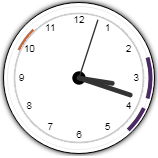
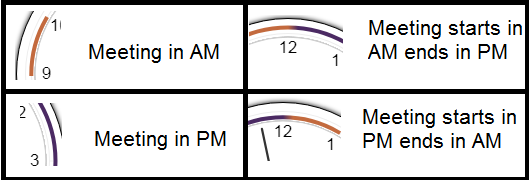

# clockSchedulerJS
(Beta Version) 
Display's a clock with highlighted scheduled area. Also has an alarm with notification for the scheduled time.

## USAGE Step-wise:::::::
<ol><li>Include the `clock.js` in your application's footer area.  <pre><code>&#x3C;script src=&#x22;clock.js&#x22;&#x3E;&#x3C;/script&#x3E;</code></pre>
 <b>Note::</b> <u>jQuery is prerequisite. <b>Place it above the clockSchedulerJS</b></u>.   You can use jQuery version of your choice, for easy reference: <pre><code>&#x3C;script src=&#x22;https://ajax.googleapis.com/ajax/libs/jquery/3.3.1/jquery.min.js&#x22;&#x3E;&#x3C;/script&#x3E;</code></pre></li>
  <li>Include the `clock.css` stylesheet in your application.  <pre><code>&#x3C;link rel=&#x22;stylesheet&#x22; type=&#x22;text/css&#x22; href=&#x22;clock.css&#x22;&#x3E;</code></pre></li>
 <li>Insert this clock snippet in your html-body 
 <pre><code>&#x3C;div class=&#x27;iasClockDiv&#x27;&#x3E;
&#x9;&#x3C;canvas class=&#x27;iasClockCanvas&#x27; id=&#x27;iasClockCanvas&#x27; width=&#x27;150px&#x27; height=&#x27;150px&#x27;&#x3E;&#x3C;/canvas&#x3E;
&#x9;&#x3C;div class=&#x27;shadow-element&#x27;&#x3E;&#x3C;/div&#x3E;
&#x9;&#x3C;div class=&#x27;hover-element&#x27;&#x3E;
&#x9;&#x9;&#x3C;button class=&#x27;plusBtn&#x27; onclick=&#x27;createMeeting();&#x27;&#x3E;+&#x3C;/button&#x3E;
&#x9;&#x9;&#x3C;button class=&#x27;listBtn&#x27; onclick=&#x27;listAll();&#x27;&#x3E;List&#x3C;/button&#x3E;
&#x9;&#x3C;/div&#x3E;
&#x3C;/div&#x3E;</code></pre></li>
  <li>Call JS function `startClock( <i>MeetingArr</i>, <i>ShowMinutesFlag</i> );` on document load. 
 <i>Explaining -</i> 
   <ol><li>There are 2 parameters for the function, as below ::</li>
   <li><i>MeetingArr - </i> You need to provide an array of structure (Lx3) where L denotes vertical length and 3 is the width.  Example:: 
    <pre><code>[[&#x27;09:53&#x27;,&#x27;10:30&#x27;,&#x27;Meeting 1&#x27;],[&#x27;14:30&#x27;,&#x27;15:30&#x27;,&#x27;Meeting 2&#x27;],[&#x27;15:53&#x27;,&#x27;16:30&#x27;,&#x27;Meeting 3&#x27;]]</code></pre>
   </li>
   <li><i>ShowMinutesFlag - </i> Binary param(true/false); if you want minutes to be drawn in the clock then specify as `true` else `false`.  <i>Note:</i> <b>If clock size is small; it is recommended to keep the flag as `false`.</b></li>
 </ol>
 </li>
 <li>
  After executing the function, you will see a clock in the right bottom corner.  
  
   Easy Right :)
 </li>
 <li>There are 4 color bands used, as shown;  </li>
 <li>You can add your custom functions in `addMeeting` and `delMeeting` (<i>in clock.js</i>), to process data at the backend.</li>
 </ol>
